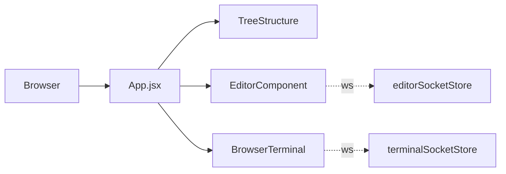
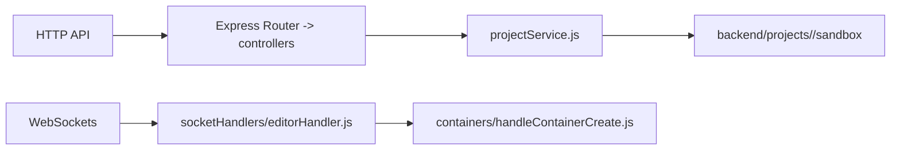
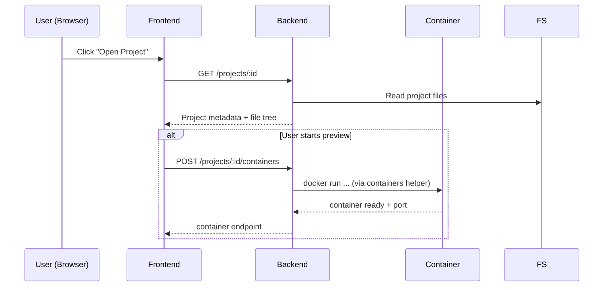
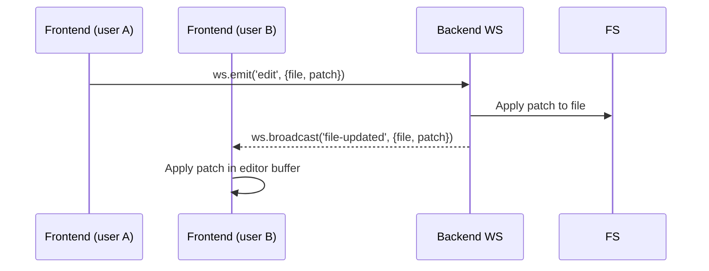
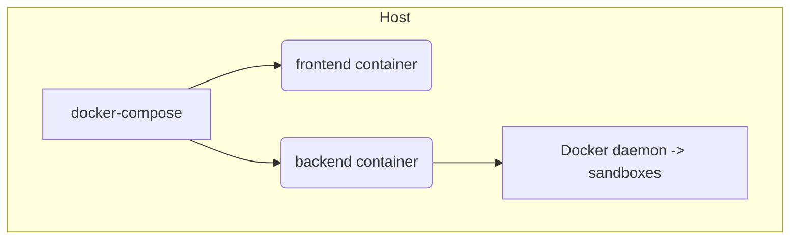

# Project Architecture — Code Sandbox Clone

This document describes the architecture of the repository in-depth, including system-level diagrams, component breakdowns, data flows, and deployment notes. Diagrams are provided as Mermaid markup so they render in Markdown viewers that support Mermaid.

---

## Table of Contents
- Overview
- High-level System Diagram
- Frontend Architecture
- Backend Architecture
- Sandbox / Project Flow
- WebSocket / Socket Flow
- Deployment & Docker
- File map & important entry points
- Operational notes

---

**Overview**

This project is a web-based code sandbox with two primary services:

- Frontend: a Vite/React SPA in `frontend/` that provides the UI, editors, terminals, and sandbox previews.
- Backend: a Node.js service in `backend/` that exposes REST APIs and WebSocket endpoints to manage projects, spawn containers/terminals, and coordinate realtime editing.

The repo also includes multiple per-project sandboxes under `backend/projects/<id>/sandbox` and Docker configurations for local and production deployments.

---

**High-level System Diagram**

```mermaid
graph TD
  Browser[Browser (User)] -->|HTTP / WebSocket| Frontend[Frontend (Vite/React)]
  Frontend -->|REST / WS| Backend[Backend (Node.js, WebSockets)]
  Backend -->|spawn| Container[Docker Containers / Sandboxes]
  Backend -->|reads/writes| FS[Project Files on Host]
  Frontend -->|optional| CDN[Static Assets / Nginx]
  Backend -->|agent| LangGraph[langgraphAgent / External AI Service]

  classDef service fill:#f9f,stroke:#333,stroke-width:1px;
  class Frontend,Backend,Container service
```

This diagram shows the browser communicating with the frontend, which in turn talks to the backend via REST and WebSocket. The backend manages containers (the sandboxes), interacts with the host filesystem for project files, and optionally integrates with an AI agent service.

---

**Frontend Architecture**

- Location: `frontend/`
- Entrypoint: `frontend/src/main.jsx`
- Router: `frontend/Router.jsx`
- Key pieces:
  - Editor UI components under `frontend/src/components/*` (EditorComponent, TreeStructure, Browser, AgentPanel)
  - API wrappers in `frontend/src/apis/` (`ping.js`, `projects.js`)
  - Stores in `frontend/src/stores/` for application state (active tabs, sockets, tree structure)
  - WebSocket clients are created from stores (e.g., `editorSocketStore.js`, `terminalSocketStore.js`)

Responsibilities:

- Present a multi-pane IDE (file tree, editor, terminal, preview)
- Manage optimistic UI and local edit buffer
- Send user actions (open file, edit, run, create terminal) to backend via REST or WS
- Receive broadcast updates from backend and update UI



---

**Backend Architecture**

- Location: `backend/`
- Entrypoint: `backend/src/index.js` or `backend/src` top-level (see `package.json`)
- Key folders:
  - `controllers/` — HTTP controllers: `agentController.js`, `projectController.js`, `pingController.js`
  - `routes/` — Express routes: `routes/v1/*`
  - `socketHandlers/` — WebSocket handlers (e.g., `editorHandler.js`)
  - `containers/` — helpers that spawn containers/terminals (`handleContainerCreate.js`, `handleTerminalCreation.js`)
  - `service/` — business logic: `projectService.js`, `langgraphAgent.js`
  - `utils/execUtility.js` — shell/exec helpers

Responsibilities:

- Serve REST APIs for CRUD operations on projects and metadata
- Host WebSocket endpoints to coordinate realtime editing and terminal I/O
- Manage lifecycle of sandbox Docker containers and terminals
- Read/write project files on disk (the sandboxes under `backend/projects/*`)
- Orchestrate agent interactions (AI features) via `langgraphAgent.js`



---

**Sandbox / Project Flow**

Each project sandbox lives under `backend/projects/<project-id>/sandbox`. When a user opens a project, the backend may:

1. Validate project and filesystem layout using `projectService.js`.
2. Spawn a Docker container for preview or isolated execution using `containers/handleContainerCreate.js`.
3. Forward container stdout/stderr to the frontend terminal via `terminalSocketStore` and the backend WS handlers.



---

**WebSocket / Realtime Editor Flow**

Key file: `backend/src/socketHandlers/editorHandler.js` (handles editor events). Typical flow:

- Frontend opens WS connection for editor events.
- When a user edits a file, frontend emits a patch/changes over WS.
- Backend receives the event, persists the change into the project files, and broadcasts the change to other connected clients.



Notes:

- The backend should perform file locking or CRDT if multi-user collaboration at scale is required. Current flow is linear: edits are applied in arrival order.
- Terminal I/O typically uses a separate `terminalSocketStore` channel; container execution is proxied to the terminal WS channel.

---

**Deployment & Docker**

Files: [docker-compose.yml](docker-compose.yml) and [docker-compose.prod.yml](docker-compose.prod.yml) define multi-service deployment.

- Services commonly present:
  - `frontend` built from `frontend/Dockerfile` or served via Nginx (see `frontend/Dockerfile.prod` and `frontend/nginx.conf`).
  - `backend` built from `backend/Dockerfile`.

Ports (defaults to verify in compose):

- Frontend dev (Vite): often `5173` (check `frontend/package.json`).
- Backend: often `3000` or `8080` (check `backend/package.json`).



Recommendation:

- In production, serve the compiled frontend behind Nginx. Use Docker networks to allow the backend to reach containers it spawns. Ensure the backend has Docker socket access if it spawns containers on the same host.

---

**File map & important entry points**

- Frontend:
  - `frontend/src/main.jsx` — app entry
  - `frontend/src/Router.jsx` — routes
  - `frontend/src/apis/` — REST client wrappers
  - `frontend/src/stores/*SocketStore.js` — websocket clients

- Backend:
  - `backend/src/index.js` or `backend/src` — server entry
  - `backend/src/routes/v1/` — REST API endpoints
  - `backend/src/controllers/` — controllers (see `agentController.js`, `projectController.js`)
  - `backend/src/socketHandlers/editorHandler.js` — editor WS handler
  - `backend/src/containers/handleContainerCreate.js` — container creation helper
  - `backend/src/service/projectService.js` — project business logic

See the project tree for additional supporting utilities under `backend/src/utils/execUtility.js`.

---

**Operational notes & security considerations**

- Spawning containers from user actions requires strict isolation and sanitization:
  - Avoid mounting host-sensitive paths into containers.
  - Run containers with limited privileges and resource limits (CPU/memory).
  - If the backend uses the Docker socket (`/var/run/docker.sock`), restrict access and consider using a container orchestrator or a controlled shim.

- WebSocket security:
  - Authenticate WS connections (session tokens / cookies / JWT).
  - Validate incoming payloads and impose size limits.

- Persistence & backups:
  - The sandboxes under `backend/projects` are file-based; provide backup and export options if users need durability.

---

**How to use this document**

- This file is intended as a living architecture document. Update it when new subsystems are added (e.g., database, caching, external agent integrations).
- For developer onboarding, reference the sections above and open the key files linked in the repo.

---

If you want, I can:

- Add diagrams rendered to PNG/SVG and place them under `docs/`.
- Add a short README-style quickstart for running the stack locally with `docker-compose`.
- Produce a sequence of recommended tests for the WebSocket flows.

---

Generated: ARCHITECTURE.md
